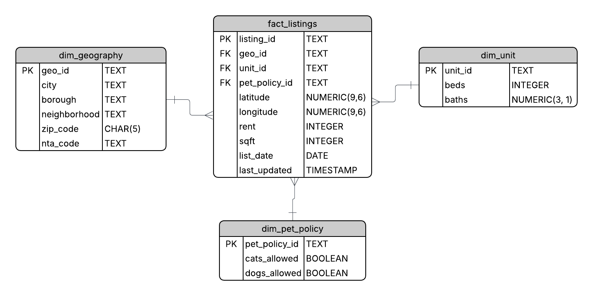
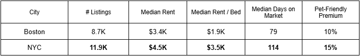

# Boston & NYC Rental Market Analytics

A renter-focused market intelligence project that consolidates **active rental listings** from **Realtor** and **Redfin** into a cloud-hosted warehouse and powers an interactive **Power BI Rental Finder** for neighborhood-level affordability and inventory analysis across **Boston** and **New York City**.

---

## Project Background

Renters often need to make location decisions under tight budget constraints, but rental data is fragmented across platforms and difficult to compare consistently at the neighborhood level. Platform-specific views also obscure important tradeoffs related to **unit size, pet policy, and inventory concentration**.

This project simulates the role of a **data analyst supporting renter decision-making**, building a consolidated view of active rental listings across Boston and NYC and translating raw listing data into **actionable affordability and supply insights**.

Insights and recommendations are provided across the following key areas:

- Affordability by budget and unit size  
- Supply by borough and neighborhood  
- Pricing tradeoffs (beds, pets, days on market)  

The **SQL** queries used to inspect and clean the data for this analysis can be found [here](sql/)

An interactive **Power BI** dashboard used to explore rental market trends can be found [here](powerbi/NYC%20%26%20BOS%20Rental%20Market%20Analysis.pbix)

A **PowerPoint** deck used to present key insights to stakeholders can be found [here](docs/Boston%20%26%20NYC%20Rental%20Market%20Insights.pptx)

---

## Data Structure Overview

The analytics layer is modeled using a **star schema** optimized for BI performance, clarity, and extensibility.

  

- **fact_listings**: One row per active listing, containing rent, square footage, list date, last updated timestamp, and geospatial coordinates.

- **dim_geography**: City, borough, neighborhood, ZIP code, and NTA mappings used for consistent geographic rollups.

- **dim_unit**: Standardized bed/bath combinations to support unit-level comparisons.

- **dim_pet_policy**: Normalized pet policy categories (cats allowed, dogs allowed).

---

## Pipeline & Warehouse Architecture

The pipeline follows a layered warehouse pattern with clear lineage from ingestion to analytics consumption.

  

- **Ingestion:** Python ETL pulls active listings from Realtor and Redfin.
- **Raw layer:** Source-aligned landing tables store unmodified listings.
- **Transform layer:** SQL and PostGIS standardize fields, deduplicate records, and enrich listings with geographic joins.
- **Analytics layer:** Curated Boston and NYC outputs are unioned into a single contract table with a `last_updated` timestamp.
- **Consumption:** Power BI connects to the analytics table via a star schema model.

---

## Executive Summary

This analysis compares current-state rental conditions in Boston and New York City using a weekly snapshot of active listings. While NYC has more total inventory, renters face meaningfully higher prices, greater geographic concentration, and fewer affordable options at common budget levels.

  

  <em>Data derived from a snapshot of ~9K Boston listings and ~12K NYC listings, last updated 12/08/2025.</em>

- **Price:** NYC’s median rent is **34% higher**, and 1–3 bedroom units are **40–60% more expensive** than in Boston.
- **Supply:** NYC listings are heavily concentrated in **Manhattan and Brooklyn** and over half of Boston listings cluster in 5 neighborhoods.
- **Affordability:** At a **$1.5K monthly budget**, Boston offers **3× more affordable listings** than NYC.

---

## Insights Deep Dive

### 1. Price: NYC Commands a Large Premium Across All Common Unit Sizes

NYC’s median rent is **34% higher overall** and 1–3 bedroom units are **40–60% more expensive**, representing all of NYC’s housing supply.

  

- NYC **3BR units** have a similar median rent to **Boston 5BR units**, highlighting a significant space-for-price tradeoff.
- NYC inventory skews toward studios and 1BRs, while Boston includes more multi-bedroom units that moderate per-bedroom costs.
- Higher NYC pricing persists despite greater total listing counts, indicating that price differences are not driven by inventory volume alone.

---

### 2. Distribution of Supply: Listings Cluster in Distinct Ways Across Cities

Although NYC has more active listings, its inventory is concentrated at the borough level, whereas over half of Boston’s supply clusters across 5 neighborhoods. While boroughs and neighborhoods are not directly comparable, both cities exhibit **geographic concentration that shapes renter choice**.

  

- **Boston:** Over one-third of listings are in Allston and Brighton, with 60% concentrated in five neighborhoods.
- **NYC:** ~85% of listings are in Manhattan and Brooklyn; Manhattan alone drives citywide pricing.
- Premium areas in both cities often exhibit high median rent but lower $/bed due to larger unit sizes.

---

### 3. Affordability: Boston Offers Far More Viable Options on a $1.5K Monthly Budget

The median salary for an associate data analyst in Boston & NYC is **$80K annually**. The maximum monthly budget recommended to spend on rent is 30% of your annual income after tax, or **$1.5K** in this case. Given that budget, Boston provides more geographic flexibility and housing choice, while finding affordable listings in NYC requires searching outside of Manhattan and Brooklyn.

  

- Boston has **~3× more affordable listings** than NYC at a $1.5K rent threshold.
- NYC affordability is largely confined to outer boroughs such as Queens, Staten Island, and the Bronx.
- Boston’s affordable listings are more geographically distributed across Dorchester, Mattapan, Roxbury, Roslindale, and Hyde Park.

---

## Recommendations

- **Lead with budget-first filtering.** Begin renter workflows with budget constraints before geography to reflect real decision behavior.
- **Use unit size as a primary tradeoff lever.** Boston offers materially better $/bed options through larger shared units.
- **NYC renters should expand beyond Manhattan and Brooklyn** to access affordable inventory.
- **Boston renters should avoid over-concentrated student hubs** when possible to reduce competition.
- **Treat pet policy as a pricing signal.** Pet-friendly requirements materially impact effective rent, especially in NYC.

---

## Assumptions and Caveats

- Analysis reflects a **weekly snapshot** of active listings, not long-term trends.
- Cross-platform deduplication is probabilistic; some duplicates may remain.
- Days-on-market metrics may be distorted by re-listings.
- Square footage coverage is incomplete; per-sqft metrics are directional.
- Boroughs and neighborhoods are analyzed **within-city**, not as equivalent units.
- Affordability thresholds are illustrative and intended to demonstrate tradeoffs.
