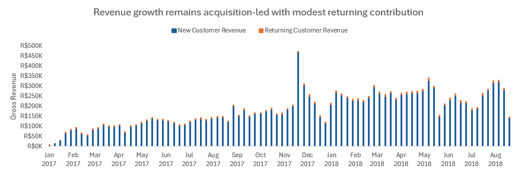
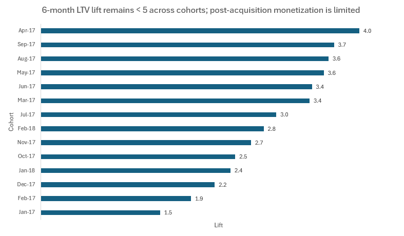
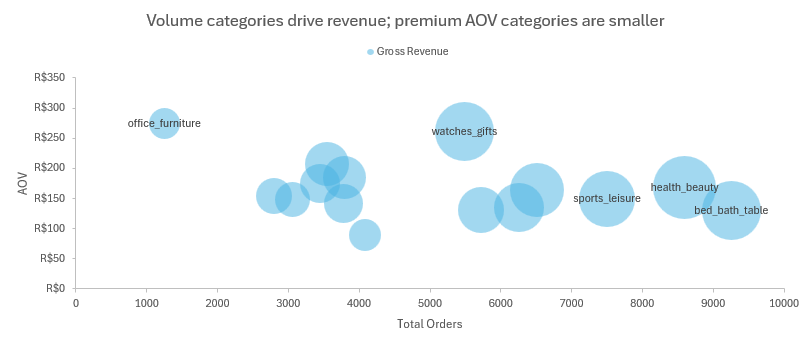
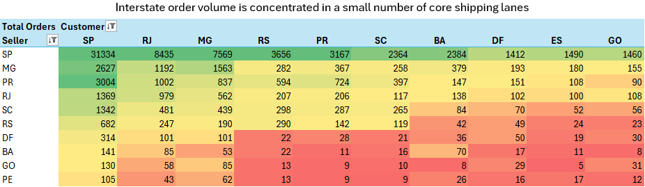

# Olist Marketing Analytics

## Project Background
Olist is a Brazilian e-commerce marketplace that connects customers and independent sellers. This project analyzes end-to-end order performance (sales, category mix, logistics, and customer experience) from **Jan 2017 to Aug 2018** to answer: *what drives revenue today, and what levers could improve repeat purchasing tomorrow?*

Insights and recommendations are provided on the following key areas:
- **Revenue & growth drivers:** weekly order volume, GMV-style revenue, and order economics (AOV, shipping share).
- **Customer retention & LTV:** cohort retention and revenue realized after the first purchase.
- **Category portfolio:** which categories drive revenue and how concentrated the mix is.
- **Geography & CX:** cross-state flows, delivery time/late delivery, and how CX correlates with 90-day repeat behavior.

**Deliverables**
- **Excel dashboard (interactive):** `deliverables/olist_workbook.xlsx` (tabs: *Executive Summary*, *Cohort Retention & LTV*, *Category Portfolio & Mix*, *Geo & CX Impact*)
- **dbt project (models + docs):** `models/` (staging → intermediate → marts)

---

## Data Model & Analytics Design

The raw Olist dataset follows a **normalized transactional schema** centered around orders, with related tables at different grains.

- Orders are stored at order grain (one row per order).
- Items, payments, and reviews exist at lower grains (multiple rows per order).
- Customers, sellers, products, and geolocation are stored as separate reference tables.

This schema reflects how the data is produced operationally and is preserved as-is for traceability.

  

*Figure: Normalized source schema showing orders, line items, payments, reviews, and reference entities.*

---

The raw schema is transformed using **dbt** into layered analytics models optimized for BI and analysis.

- **Staging models** standardize raw tables without business logic.
- **Intermediate models** consolidate reusable logic such as order-level financials, delivery experience, and customer lifecycle sequencing.
- **Mart models** provide consumption-ready aggregates for KPIs, cohort analysis, category performance, customer behavior, and geographic flows.

The lineage diagram below shows how raw source tables feed intermediate semantic models and downstream analytics marts.

  

*Figure: dbt lineage graph illustrating the transformation from raw sources to analytics-ready marts.*

## Executive Summary
Across **98,962 orders**, Olist generated **R$ 15.8M** in gross revenue with **R$ 137 AOV** and shipping representing **~14.2%** of gross revenue.

Three takeaways for stakeholders:
1. **The business is highly acquisition-driven.** Cohort retention is extremely low and only **2.1%** of customers repeat within 90 days, meaning LTV is almost entirely realized on the first order.
2. **Revenue is concentrated across both categories and geography.** The top 10 categories drive **62.4%** of revenue, and **São Paulo (SP)** accounts for **41.9%** of customer orders while **70.8%** of seller-fulfilled orders originate from SP.
3. **Cross-state fulfillment is the operational hotspot.** Only **35.8%** of orders are fulfilled within the same state; cross-state orders take **14.6 days** vs **8.4 days** in-state and have a higher late-delivery rate.

  

---

## Insights Deep Dive

### 1) Revenue & growth drivers
- **Holiday weeks create outsized volume spikes.** The week of Black Friday generated **R$ 474,624** in gross revenue which is about **2.8×** the weekly average.
- **Order economics are stable and shipping is a meaningful but not dominant driver.** Shipping averages **14.2%** of gross revenue, and baskets are typically single-item with an average of **items** items per order.

  

### 2) Customer retention & LTV
- **Retention collapses after the first order.** Weighted month+1 retention is only **0.5%**, consistent with the low 90-day repeat rate of **2.1%**.
- **LTV is almost entirely first-purchase revenue.** Average cumulative revenue per cohort customer is R$ **162** in month 0 and only R$ **163** by month 6, so repeat purchases contribute **0.4%** of 6-month value.

  

### 3) Category portfolio & mix
- **The catalog is concentrated.** The top 5 categories drive **39.3%** of revenue and the top 10 drive **62.4%**.
- **High-revenue categories combine frequency + basket value.** Consistent leaders include *health & beauty*, *bed/bath/table*, *watches & gifts*, and *sports & leisure*.

  

### 4) Geography & CX impact (delivery + reviews)
- **Most commerce is cross-state.** Only **35.8%** of orders are in-state, and cross-state shipments are slower by an average of **6.2** days.
- **Cross-state routes have higher service risk.** Late delivery rises from **4.3%** in-state to **6.3%** cross-state, with especially high late rates on major long-haul corridors (e.g. SP → RJ, SP -> BA).
- **CX signals matter most where customers are already unhappy.** Late delivery is associated with lower repeat rates for low-rating customers, suggesting a “double hit” effect: poor experience + delay.

  

---

## Recommendations
Based on the findings above, recommended actions for a Growth + Operations stakeholder team:

1. **Treat retention as a product problem, not a reporting metric.** With repeat rates at 2.1%, LTV is constrained. Pilot low-cost retention levers: post-purchase email/SMS, category-specific reactivation offers, and “second-order” incentives within 30–60 days.
2. **Target logistics improvements where the risk is concentrated.** Cross-state routes are slower and later. Prioritize carrier SLAs and inventory positioning for high-volume corridors starting with SP outflows.
3. **Use category concentration to focus experimentation.** Since 62.4% of revenue comes from 10 categories, run pricing, promotion, and merchandising tests in these categories first to maximize signal and business impact.
4. **Close the loop from CX signals to interventions.** Use first-order delivery speed and review sentiment as triggers for proactive support to reduce churn risk among customers who had a bad first experience.

---

## Assumptions and Caveats
- **Revenue definition:** “gross revenue” is GMV-style: `price + freight_value` from order items (not net of refunds/chargebacks).
- **Customer retention definitions vary by table:** monthly cohorts measure activity in the *next calendar months*, while `mart_experience_retention_90d` measures *any repeat purchase within 90 days* of first delivered order.
- **New vs returning weekly counts are weekly aggregates:** summing weekly “new customers” can overcount across weeks; interpret shares directionally rather than as distinct lifetime counts.
- **Review coverage is incomplete:** a “no_review” segment exists; review sentiment may be selection-biased.
- **Time period:** dataset covers 2017-01-02–2018-08-20; results may not generalize to current marketplace dynamics.

