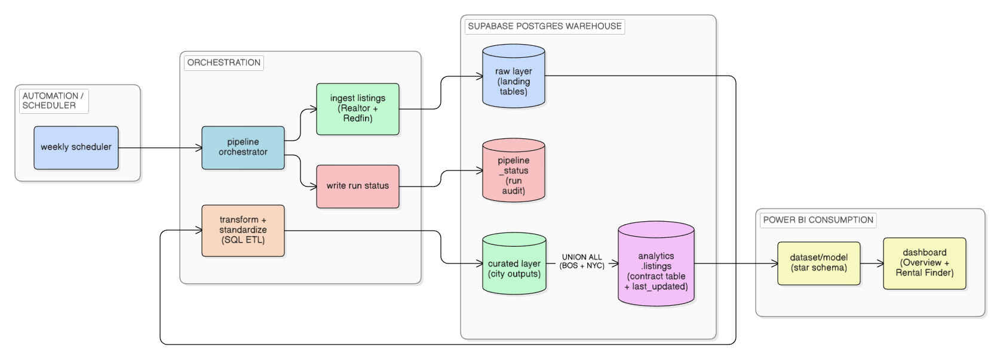
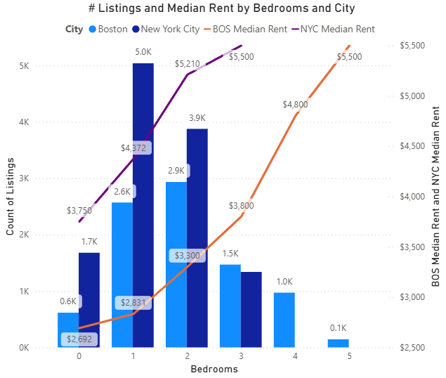
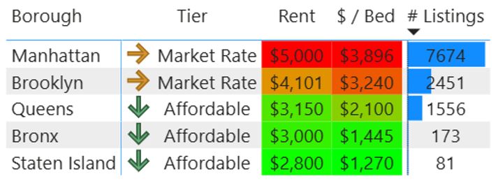
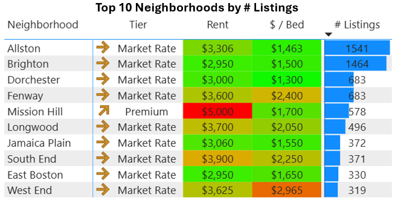
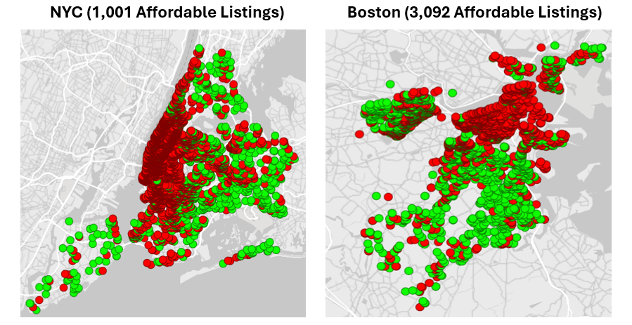

# Boston & NYC Rental Market Analytics

A renter-focused market intelligence project that consolidates **active rental listings** from **Realtor** and **Redfin** into a cloud-hosted warehouse and powers an interactive **Power BI Rental Finder** for neighborhood-level affordability and inventory analysis across **Boston** and **New York City**.

---

## Project Background

Renters often need to make location decisions under tight budget constraints, but rental data is fragmented across platforms and difficult to compare consistently at the neighborhood level. Platform-specific views also obscure important tradeoffs related to **unit size, pet policy, and inventory concentration**.

This project simulates the role of a **data analyst supporting renter decision-making**, building a consolidated view of active rental listings across Boston and NYC and translating raw listing data into **actionable affordability and supply insights**.

Insights and recommendations are provided across the following key areas:

- Affordability by budget and unit size  
- Supply by borough and neighborhood  
- Pricing tradeoffs (beds, pets, days on market)  

The SQL queries used to inspect and clean the data for this analysis can be found here:  
[`sql/`](sql/)

An interactive Power BI dashboard used to explore rental market trends can be found here:  
[`powerbi/NYC & BOS Rental Market Analysis.pbix`](powerbi/NYC%20%26%20BOS%20Rental%20Market%20Analysis.pbix)

A PowerPoint deck used to present key insights to stakeholders can be found here:  
[`docs/Boston & NYC Rental Market Insights.pptx`](docs/Boston%20%26%20NYC%20Rental%20Market%20Insights.pptx)

---

## Data Structure Overview

The analytics layer is modeled using a **star schema** optimized for BI performance, clarity, and extensibility.

**Core tables:**

- **fact_listings**  
  One row per active listing, containing rent, square footage, list date, last updated timestamp, and geospatial coordinates.

- **dim_geography**  
  City, borough, neighborhood, ZIP code, and NTA mappings used for consistent geographic rollups.

- **dim_unit**  
  Standardized bed/bath combinations to support unit-level comparisons.

- **dim_pet_policy**  
  Normalized pet policy categories (cats allowed, dogs allowed).

This structure allows the Power BI semantic model to remain clean while supporting flexible slicing by geography, unit size, and renter constraints.

---

## Pipeline & Warehouse Architecture

The pipeline follows a layered warehouse pattern with clear lineage from ingestion to analytics consumption.

**Flow overview:**

- **Ingestion:** Python ETL pulls active listings from Realtor and Redfin.
- **Raw layer:** Source-aligned landing tables store unmodified listings.
- **Transform layer:** SQL and PostGIS standardize fields, deduplicate records, and enrich listings with geographic joins.
- **Analytics layer:** Curated Boston and NYC outputs are unioned into a single contract table with a `last_updated` timestamp.
- **Consumption:** Power BI connects to the analytics table via a star schema model.

This design mirrors production analytics workflows used by data and analytics teams.

---

## Executive Summary

This analysis compares current-state rental conditions in Boston and New York City using a weekly snapshot of active listings. While NYC has more total inventory, renters face meaningfully higher prices, greater geographic concentration, and fewer affordable options at common budget levels.

*Data derived from a snapshot of ~9K Boston listings and ~12K NYC listings, last updated 12/17/2025.*

**Key takeaways:**

- **Price:** NYC’s median rent is **34% higher**, and 1–3 bedroom units (which represent nearly all NYC supply) are **40–60% more expensive** than in Boston.
- **Supply distribution:** NYC listings are heavily concentrated in **Manhattan and Brooklyn**, while Boston inventory clusters across a small number of high-activity neighborhoods.
- **Affordability:** At a **$1.5K monthly budget**, Boston offers **~3× more viable listings** than NYC, resulting in substantially greater geographic flexibility.

---

## Insights Deep Dive

This section expands on the Executive Summary by examining **price dynamics**, **distribution of supply**, and **practical affordability** in greater detail. Each insight pairs analysis with a targeted visual to support renter-relevant conclusions.

---

### 1. Price: NYC Commands a Large Premium Across All Common Unit Sizes

NYC rents are consistently higher than Boston rents at every comparable bedroom size, with the gap widening as unit size increases. Although NYC’s median rent is **34% higher overall**, 1–3 bedroom units are **40–60% more expensive**, representing nearly the entirety of NYC’s housing supply.

**Key observations:**

- NYC **3BR units** have a similar median rent to **Boston 5BR units**, highlighting a significant space-for-price tradeoff.
- NYC inventory skews toward studios and 1BRs, while Boston includes more multi-bedroom units that moderate per-bedroom costs.
- Higher NYC pricing persists despite greater total listing counts, indicating that price differences are not driven by inventory volume alone.

**Why it matters:**  
Renters face structurally different cost environments. In NYC, higher rents are unavoidable across typical unit sizes, while Boston offers more flexibility for shared housing and larger-unit tradeoffs.

---

### 2. Distribution of Supply: Listings Cluster in Distinct Ways Across Cities

Although NYC has more active listings, its inventory is concentrated at the borough level, whereas Boston’s supply clusters across a small set of neighborhoods that function as distinct rental submarkets.

**Key observations:**

- **NYC:** ~85% of listings are in Manhattan and Brooklyn; Manhattan alone drives citywide pricing.
- **Boston:** Over one-third of listings are in Allston and Brighton, with 60% concentrated in five neighborhoods.
- Premium areas in both cities often exhibit high median rent but lower $/bed due to larger unit sizes.

**Why it matters:**  
While boroughs and neighborhoods are not directly comparable administrative units, both cities exhibit **geographic concentration that shapes renter choice**, competition, and pricing pressure.

---

### 3. Affordability: Boston Offers Far More Viable Options at a $1.5K Budget

Applying a practical affordability lens reveals stark differences in renter flexibility.

**Key observations:**

- Boston has **~3× more affordable listings** than NYC at a $1.5K rent threshold.
- NYC affordability is largely confined to outer boroughs such as Queens, Staten Island, and the Bronx.
- Boston’s affordable listings are more geographically distributed across Dorchester, Mattapan, Roxbury, Roslindale, and Hyde Park.

**Why it matters:**  
For renters earning around **$80K annually**, Boston provides substantially more geographic flexibility and housing choice, while NYC affordability often requires accepting tighter location constraints.

---

## Recommendations

- **Lead with budget-first filtering.** Begin renter workflows with budget constraints before geography to reflect real decision behavior.
- **Use unit size as a primary tradeoff lever.** Boston offers materially better $/bed options through larger shared units.
- **NYC renters should expand beyond Manhattan and Brooklyn** to access affordable inventory.
- **Boston renters should avoid over-concentrated student hubs** when possible to reduce competition.
- **Treat pet policy as a pricing signal.** Pet-friendly requirements materially impact effective rent, especially in NYC.

---

## Assumptions and Caveats

- Analysis reflects a **weekly snapshot** of active listings, not long-term trends.
- Cross-platform deduplication is probabilistic; some duplicates may remain.
- Days-on-market metrics may be distorted by re-listings.
- Square footage coverage is incomplete; per-sqft metrics are directional.
- Boroughs and neighborhoods are analyzed **within-city**, not as equivalent units.
- Affordability thresholds are illustrative and intended to demonstrate tradeoffs.
